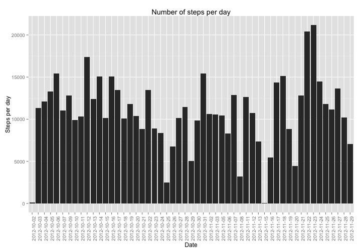
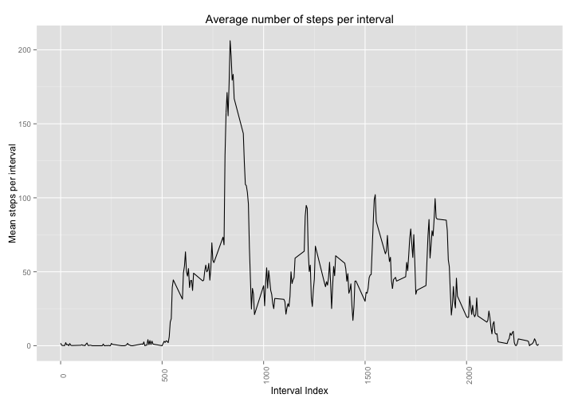
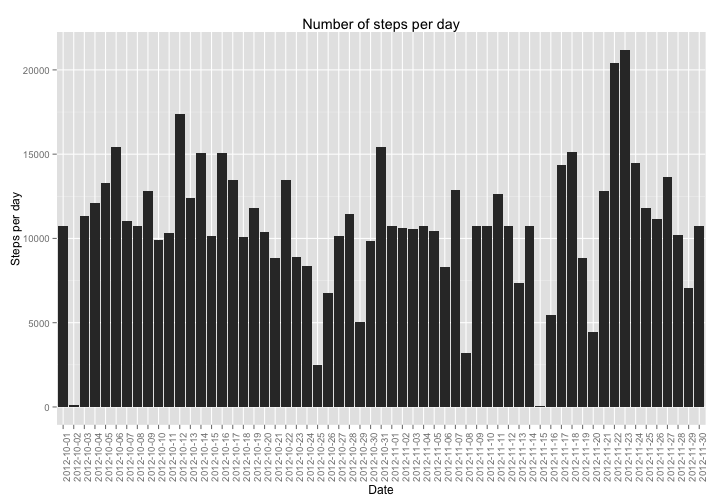
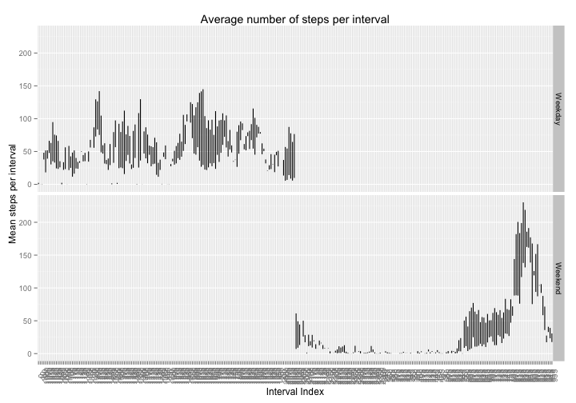

## Loading and preprocessing the data
Load the data from activity.csv

```r
library(ggplot2)
walkActivity <- read.csv("activity.csv")
walkActivity <- transform(walkActivity, date = as.Date(date, "%Y-%m-%d"))
```


## What is mean total number of steps taken per day?

```r
stepsPerDayArray <- tapply(walkActivity$steps, walkActivity$date, sum, na.rm = T)
stepsPerDay <- data.frame(date = names(stepsPerDayArray), steps = as.numeric(stepsPerDayArray))
stepsPerDay <- stepsPerDay[stepsPerDay$steps != 0, ]
plot <- ggplot(stepsPerDay, aes(x = stepsPerDay$date, y = stepsPerDay$steps))
plot <- plot + geom_histogram(stat = "identity")
plot <- plot + labs(title = "Number of steps per day", x = "Date", y = "Steps per day")
plot <- plot + theme(axis.text.x = element_text(angle = 90))
plot 
```



```r
meanStepsPerDay <- mean(stepsPerDay$steps)
medianStepsPerDay <- median(stepsPerDay$steps)
```

Mean number of steps per day: ``1.0766189 &times; 10<sup>4</sup>``.  
Median of the number of steps per day: ``1.0765 &times; 10<sup>4</sup>``.

## What is the average daily activity pattern?

```r
meanStepsPerIntervalArray <- tapply(walkActivity$steps, walkActivity$interval, mean, na.rm = T)
meanStepsPerInterval <- data.frame(interval = as.numeric(names(meanStepsPerIntervalArray)), steps = as.numeric(meanStepsPerIntervalArray))
plot <- ggplot(meanStepsPerInterval, aes(x = meanStepsPerInterval$interval, y = meanStepsPerInterval$steps))
plot <- plot + geom_line()
plot <- plot + labs(title = "Average number of steps per interval", x = "Interval Index", y = "Mean steps per interval")
plot <- plot + theme(axis.text.x = element_text(angle = 90))
plot 
```



```r
intervalWithMaxMean <- meanStepsPerInterval[which.max(meanStepsPerInterval$steps), "interval"]
```

Interval with highest mean number of steps: ``835``

## Imputing missing values

The missing input values are being filled with the mean number of steps in that interval, taken over all the days.


```r
indicesOfMissingValues <- which(is.na(walkActivity$steps))
numberOfMissingValues <- length(indicesOfMissingValues)

filledWalkingActivity <- transform(walkActivity)
missingRecords <- filledWalkingActivity[is.na(filledWalkingActivity$steps), ]
filledWalkingActivity[is.na(filledWalkingActivity$steps), "steps"] <- apply(missingRecords, 1, function(record) {
    meanStepsPerInterval[meanStepsPerInterval$interval == as.numeric(record["interval"]), "steps"]
})

filledStepsPerDayArray <- tapply(filledWalkingActivity$steps, filledWalkingActivity$date, sum, na.rm = T)
filledStepsPerDay <- data.frame(date = names(filledStepsPerDayArray), steps = as.numeric(filledStepsPerDayArray))
filledStepsPerDay <- filledStepsPerDay[filledStepsPerDay$steps != 0, ]
plot <- ggplot(filledStepsPerDay, aes(x = filledStepsPerDay$date, y = filledStepsPerDay$steps))
plot <- plot + geom_histogram(stat = "identity")
plot <- plot + labs(title = "Number of steps per day", x = "Date", y = "Steps per day")
plot <- plot + theme(axis.text.x = element_text(angle = 90))
plot 
```



```r
filledMeanStepsPerDay <- mean(filledStepsPerDay$steps)
filledMedianStepsPerDay <- median(filledStepsPerDay$steps)
```

Total number of missing values in the dataset: ``2304``.  
After filling in the missing values, here are the new mean and median for the number of steps per day:  
Mean: ``1.0766189 &times; 10<sup>4</sup>``  
Median: ``1.0766189 &times; 10<sup>4</sup>``  

From the values obtained, we observe that the mean remains the same even after filling in the empty values. But the median has changed to the new mean value, probably because a lot of these values were filled it around the middle of the distribution.

## Are there differences in activity patterns between weekdays and weekends?

```r
weekFactor <- factor(weekdays(filledWalkingActivity$date) %in% c("Saturday", "Sunday"))
levels(weekFactor) <- list(Weekday = "FALSE", Weekend = "TRUE")
filledWalkingActivity$dayGroup <- weekFactor

dayGroupSpecific <- split(filledWalkingActivity, filledWalkingActivity$dayGroup)
dfsForGroups <- lapply(levels(weekFactor), function(groupName) {
        print(groupName)
        groupDF <- dayGroupSpecific[[groupName]]
        meanArray <- tapply(groupDF$steps, groupDF$interval, mean)
        summaryDF <- data.frame( intervalName = names(meanArray), meanSteps = as.numeric(meanArray), dayGroup = rep(groupName, length(meanArray)))
})
```

```
## [1] "Weekday"
## [1] "Weekend"
```

```r
mergedDF <- merge(dfsForGroups[[1]], dfsForGroups[[2]], all = T)
plot <- ggplot(mergedDF, aes(x = mergedDF$intervalName, y = mergedDF$meanSteps))
plot <- plot + geom_line()
plot <- plot + facet_grid(dayGroup ~ .)
plot <- plot + labs(title = "Average number of steps per interval", x = "Interval Index", y = "Mean steps per interval")
plot <- plot + theme(axis.text.x = element_text(angle = 90))
plot 
```


